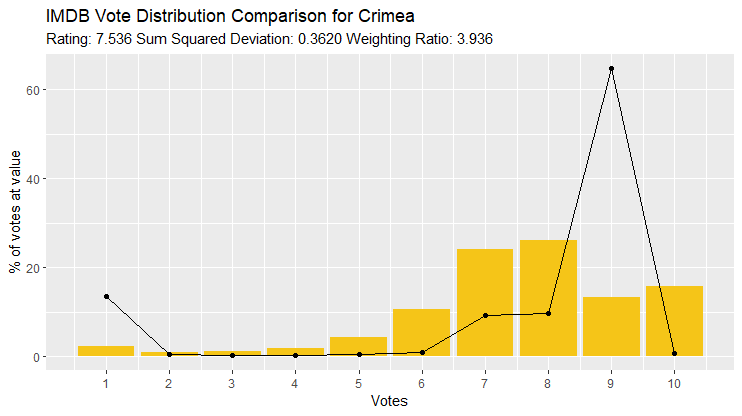

# IMDB_Distribution_Analysis
Tools for investigating vote distributions in IMDB.

Can be used to easily isolate anomolous films that could be considered "controversial", or have a controversial response from voters. These tools expose things like purchased votes, racism, genocide denial, propaganda and political controversy.

### Score Distribution Deviation

IMDB currently offers datasets containing film details as well as mean scores, and the total number of votes submitted. Visibly available on the website however, but not quite as easily available, are the numbers of votes submitted for a film between (and inclusive of) 1 and 10. IMDB also nicely provide an interesting chart of these vote distributions (eg. [Alvin and the Chipmunks](https://www.imdb.com/title/tt0952640/ratings/?ref_=tt_ov_rt)). Given full knowledge of all films distributions, we can find an average, or expected distribution for a film's score value proportions at any average score. Then, we can evaluate the deviation of a film's distribution from the expected one. The greater this deviation, the more suspicious the film, and this often leads to interesting stories.

<i>Sum of Squares Voting Distribution Error = Σ(film vote proportion - expected vote proportion)²</i>

Examples of the expected vote distribution of films to their actual vote distributions are below.

  
   
  <i>Distribution comparison for votes for <a href=https://www.imdb.com/title/tt0952640/?ref_=ttrt_ov>Alvin and the Chimpunks</a> (in yellow), compared to the expected distribution (in black)</i>

"Alvin and the Chimpunks (2007)", a family or child oriented film about three musical, anthropomorphic chipmunks, had an extremely predictable audience response based on films with average ratings of 5.51±0.2 (close to the average unweighted score of Alvin and the Chimpunks), with a calculated deviation based on a sum of squares error of 4.6099e-05. It could be claimed that "Alvin and the Chimpunks" is unlikely to be a divisive or controversial film based on the audience response.

  
   
  <i>Distribution comparison for votes for <a href=https://www.imdb.com/title/tt4776998/>The Promise</a> (in yellow), compared to the expected distribution (in black)</i>

In contrast to "Alvin and the Chimpunks", the film "The Promise (2016)", a film focused on the Armenian genocide, had a voter response far from the expected distribution, with a sum of squres error of 0.3989. Voters for this film were heavily inclined to give this film either 1, or 10 stars, which does not follow typical voting patterns for a film with this average rating.

### Weighted vs Unweighted Score Ratio

The score on any film's page on IMDB is actually a weighted score. IMDB have certain metrics to weight votes, to counteract suspicious activity such as vote purchasing from click farms, or otherwise bizarre and impossible vote behaviour. The exact methods for weighting used are not disclosed to make it harder to circumvent them. It's interesting however, to isolate the films with large differences between the actual vote averages, and the weighted averages.

  
   
  <i>Distribution comparison for votes for <a href=https://www.imdb.com/title/tt4776998/>The Oogieloves in the Big Balloon Adventure</a> (in yellow), compared to the expected distribution (in black)</i>

Oogieloves in the Big Balloon Adventure (2012), a film about puppets searching for lost, magical balloons, not only has a very high sum squared deviation value, but it also has a very high difference in average vote score and weighted vote score. Observing that OitBBA has 12,125 votes of 10 stars, but only 241 votes at 9 stars, making the voting patterns for this film extremely unusual. The weighted difference value for OitBBA is 6.601, so IMDB's weighting system, for whatever reason, has decided to almost entirely eliminate the impact of all of these 10 star votes, reducing the average score from an exceptional 8.301 (suggesting it's a marginally better film than "The Shining") to a very concerning 1.7.
 
The suggestion here, is that OitBBA may have engaged in vote purchasing, or perhaps a single person submitted the vast majority of the 12,125 10 star votes on their own, in either case, the average score does not actually reflect popular opinion on the quality of the film.

  
   
  <i>Distribution comparison for votes for <a href=https://www.imdb.com/title/tt6990206/>Crimea</a> (in yellow), compared to the expected distribution (in black)</i>

Even more interesting, are films like Crimea (2017). I can't want to bring myself to summarise "Crimea", so the current storyline for the film on IMDB reads: "This is a story of love, faith and honor, the strength of spirit and true friendship against the backdrop of the real events of the Crimean spring of 2014.". Crimea has similar patterns as OitBBA in that there are 21,675 votes at 9 stars, but only 191 at 10 stars. As a result, it again has a very high sum squared deviation, and a very high weighted difference, suggesting IMDB's system is skeptical about the authenticity of the 9 star votes in some way.
 
Injecting a small, but appropriate amount of opinion here, it appears that this extremely blatant Russian propaganda film purchased votes at 9 stars, believing that might be clever enough to circumvent IMDB's weighting system (unsuccessfully). Otherwise we are forced to believe the many fans who loved the film at 9 stars observed some flaw that stopped them going all the way to 10...

### Usage Details

Provided in this repository is a python script to sequentially scrape and archive all film distributions from IMDB (from a curated list to reduce the time this would take), or just return the distribution of a particular film. Also included is an R script to calculate the expected distributions of films, parameterised with band width values (eg. width = 0.1, will return a distribution using average proportions from all films with an average rating ±0.1 of the target film's rating), then compare films to their expected distributions using sum of squares regression.

TO BE UPDATED SOON

#### TO DO
- Add archived datetime to scraping tool
